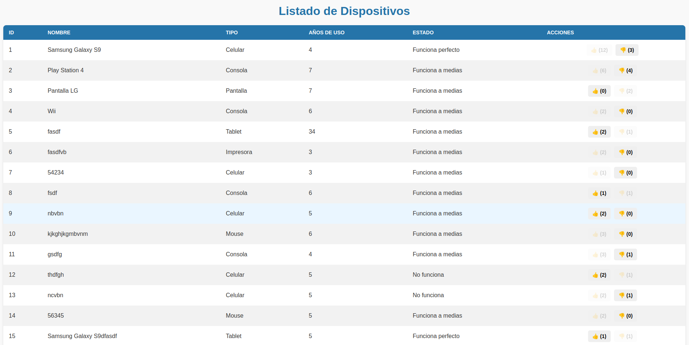

# Tarea 4 - Aplicación de Dispositivos

## **Descripción**
Esta es una aplicación web desarrollada como parte de la tarea 4 del curso, que permite gestionar dispositivos a través de un listado dinámico. La aplicación incluye la funcionalidad para interactuar con los dispositivos mediante botones de "Me gusta" y "No me gusta", actualizando los contadores asociados en tiempo real usando AJAX.

## **Tecnologías Utilizadas**
- **Backend:**
    - Framework: Spring Boot.
    - Lenguaje: Java 17.
    - Base de datos: MySQL.
    - ORM: Spring Data JPA.
- **Frontend:**
    - Lenguajes: HTML5, CSS3, JavaScript.
    - Biblioteca: jQuery para manejo de AJAX.
- **Herramientas:**
    - Maven para gestión de dependencias.
    - Validadores W3C para HTML y CSS.

---

## **Estructura del Proyecto**
La estructura del proyecto está organizada de la siguiente manera:

```
src/
├── main/
│   ├── java/
│   │   └── com.example.tarea4/
│   │       ├── controller/
│   │       │   └── DispositivoController.java    # Controlador principal
│   │       ├── model/
│   │       │   ├── converters/
│   │       │   │   ├── EstadoDispositivoConverter.java
│   │       │   │   └── TipoDispositivoConverter.java
│   │       │   ├── Contacto.java                 # Modelo Contacto
│   │       │   ├── Dispositivo.java              # Modelo Dispositivo
│   │       │   ├── EstadoDispositivo.java
│   │       │   └── TipoDispositivo.java
│   │       ├── repository/
│   │       │   └── DispositivoRepository.java    # Repositorio para acceso a BD
│   │       └── Tarea4Application.java            # Clase principal
│   ├── resources/
│   │   ├── static/
│   │   │   ├── script.js                         # Lógica del frontend
│   │   │   └── styles.css                        # Estilo del frontend
│   │   ├── templates/
│   │   │   └── index.html                        # Interfaz principal
│   │   └── application.properties                # Configuración del proyecto
└── test/
```

---

## **Funcionalidades**
1. **Listado de Dispositivos:**
    - La interfaz muestra una tabla con los siguientes campos:
        - ID, Nombre, Tipo, Años de uso, Estado.
        - Botones para "Me gusta" y "No me gusta" con sus contadores.

2. **Interacción con los botones:**
    - Los usuarios pueden dar "Me gusta" o "No me gusta" a un dispositivo.
    - Los contadores se actualizan en tiempo real mediante AJAX.
    - Si el usuario activa un botón, el otro se desactiva automáticamente.

3. **Persistencia en la Base de Datos:**
    - Los contadores de likes y dislikes se almacenan en la base de datos para persistencia.

4. **Validación y Estilo:**
    - Código HTML y CSS validado por W3C.

---

## **Instalación y Configuración**

1**Configurar `application.properties`:**
    - El archivo ya está configurado con los valores necesarios para conectarse a la base de datos. Las credenciales son las siguientes:
      ```
      spring.datasource.url=jdbc:mysql://localhost:3306/tarea2
      spring.datasource.username=cc5002
      spring.datasource.password=programacionweb
      spring.jpa.hibernate.ddl-auto=update
      spring.jpa.show-sql=true
      spring.jpa.open-in-view=false
      ```

2**Ejecutar la Aplicación:**
    - Usa Maven para compilar y ejecutar el proyecto:
      ```bash
      mvn spring-boot:run
      ```

3**Acceso a la Interfaz:**
    - Abre tu navegador y accede a `http://localhost:8080`.

---

## **Endpoints**
Los siguientes endpoints están implementados en el controlador `DispositivoController`:

| Método | Endpoint                  | Descripción                                   |
|--------|---------------------------|-----------------------------------------------|
| GET    | `/api/dispositivos`       | Obtiene todos los dispositivos.              |
| POST   | `/api/dispositivos/{id}/like`  | Incrementa el contador de "Me gusta".         |
| POST   | `/api/dispositivos/{id}/dislike`| Incrementa el contador de "No me gusta".      |
| POST   | `/api/dispositivos/{id}/unlike` | Decrementa el contador de "Me gusta".         |
| POST   | `/api/dispositivos/{id}/undislike`| Decrementa el contador de "No me gusta".      |

---

## **Captura de Pantalla**


---

## **Autores**
- **Nombre del estudiante:** Fabián Castro Contreras
- **Curso:** CC5002 - Desarrollo de Aplicaciones Web
- **Profesor:** José Urzúa
